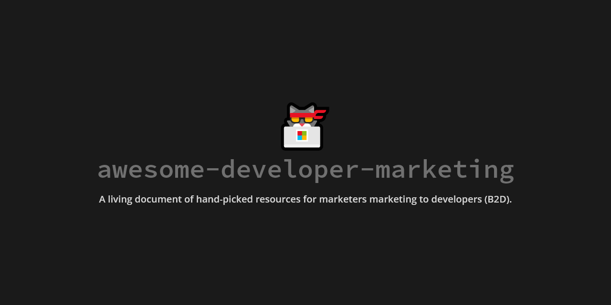

# awesome-developer-marketing

A living document of (sometimes pretty unstructured and often off-on-a-tangent) hand-picked resources for marketers who're marketing to developers (B2D).

🚧 Very much still a work in progress 🚧

I also have another list of [awesome-marketing](https://github.com/ronakganatra/awesome-marketing) resources.

Ever since joining [GraphCMS](https://graphcms.com) I've been on a steep learning curve - figuring out how different B2D is compared to B2C/B2B. I've grown to love the developer mindset of rewarding helpful content, avoiding shady gated practices, and building engaging communities - and I've tried to catalog my resources to help others out as well.

Want to contribute to grow/improve this? PRs welcome!

## Basics (Start Here)

- WTF is Developer Marketing? [Option 1](https://ironhorse.io/what-is-developer-marketing) | [Option 2](https://www.datadab.com/blog/developer-marketing/) | [Option 3](https://medium.com/@nishers/what-is-developer-marketing-84dde2ddacc1) | [Option 4](https://developerrelations.com/what-is-b2d-or-developer-marketing)
- [WTF is Jamstack?](https://jamstack.org/what-is-jamstack/)
- [WTF is Developer Relations?](https://www.marythengvall.com/blog/2019/5/22/what-is-developer-relations-and-why-should-you-care)
- [WTF is B2D?](https://snipcart.com/blog/b2d-marketing-selling-to-developers) (⭐)
- [WTF is a Developer Marketing Plan?](https://www.datadab.com/blog/developer-marketing/)
- [WTF is Headless Software?](https://techoverflow.net/2019/05/17/what-is-a-headless-program-or-application/)
- [WTF is a Developer Marketing Strategy?](https://www.jesse-williams.com/creating-developer-marketing-strategy) (⭐)
- [WTF does DevRel do?](https://medium.com/google-developers/the-core-competencies-of-developer-relations-f3e1c04c0f5b)
- [Is Developer Relations Developer Marketing?](https://aspleenic.medium.com/developer-relations-and-developer-marketing-they-arent-the-same-thing-35b896159825) (⭐)
- [Learning how to market to developers](https://devada.com/learning-how-market-to-developers/)
- [Imporance of using experts in Developer Marketing](https://techcrunch.com/2021/07/29/draft-dev-ceo-karl-hughes-on-the-importance-of-using-experts-in-developer-marketing/) (⭐)

## Blogs and Websites

- [Jesse Williams](https://www.jesse-williams.com/)
- [Mary Thengvall](https://www.marythengvall.com/)
- [Tom Wentworth](https://tomwentworth.com/)
- [SWYX](https://www.swyx.io/) 
- [Scott Spence](https://www.scottspence.com/) 
- [Sarah Drasner](https://sarahdrasnerdesign.com/)
- [Colby Fayock](https://www.colbyfayock.com/)
- [DevRelX](https://www.devrelx.com/blog)

## Books

- [Developer Marketing and Relations: The Essential Guide](https://www.amazon.com/Developer-Marketing-Relations-Essential-Guide/dp/B08KH3T5TN/ref=sr_1_1)
- [Developer Marketing Does Not Exist: The Authentic Guide to Reach a Technical Audience](https://www.amazon.com/Developer-Marketing-Does-Not-Exist-ebook/dp/B091NK954H/ref=sr_1_4)
- [Ask Your Developer: How to Harness the Power of Software Developers and Win in the 21st Century](https://www.amazon.com/Ask-Your-Developer-Software-Developers/dp/0063018292/ref=sr_1_5)
- [The Business Value of Developer Relations: How and Why Technical Communities Are Key To Your Success](https://www.amazon.com/Business-Value-Developer-Relations-Communities/dp/1484237471/ref=sr_1_13)
- [Developer, Advocate!: Conversations on turning a passion for talking about tech into a career](https://www.amazon.com/Developer-Advocate-Conversations-turning-passion/dp/1789138744/ref=rtpb_5)
- [Working in Public: The Making and Maintenance of Open Source Software](https://www.amazon.com/Working-Public-Making-Maintenance-Software/dp/0578675862/ref=pd_sim_4)

## Developer Marketing Centric Resources (and some DevRel relevance)

- [The Developer Marketing Guide](https://www.devmarketingguide.com/)
- [The B2D model and marketing to developers](https://opensenselabs.com/blog/articles/marketing-developers-b2d) (⭐)
- [The B2D Sales Process](https://manticoreblog.wordpress.com/2017/01/15/b2d-marketing/)
- [How to build a strong developer brand?](https://helenmin.com/blog/marketing-to-developers) (⭐)
- [4 Tips for B2D Marketing](https://www.linkedin.com/pulse/4-tips-business-to-developer-b2d-marketing-apurva-dave/)
- [Go to Market challenges for B2D](https://tomtunguz.com/b2d-go-to-market/) (⭐)
- [Why is marketing to developers different?](https://developerrelations.com/what-is-b2d-or-developer-marketing) (⭐)
- [Content Marketing for Developers Emphasizes the Content, not the Marketing](https://devada.com/content-vs-marketing-understand-the-difference-to-connect-with-developers/)
- [What Are You Missing in Marketing Your API?](https://devada.com/marketing-your-api/) (⭐)
- [B2B developer marketing? It’s complicated](https://martechtoday.com/b2b-developer-marketing-complicated-205934)
- [The Go-to-Market Channels Every Developer Marketer Needs](https://devada.com/channels-every-developer-marketer-needs/)
- [Marketing to Developers with John Britton](https://speakerdeck.com/johndbritton/marketing-to-developers)
- [A Guide to Developer Marketing](https://dev.to/nickparsons/a-guide-to-developer-marketing-in-2020-5f0f)
- [Developer Marketing - Is it an oxymoron?](https://fishfaceishi.medium.com/developer-marketing-is-it-an-oxymoron-31ff3c159c32)
- [A Primer on Developer Marketing](https://tomwentworth.com/2016/10/13/a-primer-on-developer-marketing-47d792d67586/) (⭐)
- [The Struggle of Marketing to Developers](https://glennstovall.com/marketing-to-developers/)
- [How to market to Software Developers? A comment thread](https://www.indiehackers.com/forum/how-to-market-to-software-developers-73ee7a15fe)
- [Understanding Developer Marketing](https://blog.codacy.com/marketing-to-developers/)
- [Marketing to Developers: Core Values & Tactical Tips from Gitlab’s Ashley Smith](https://openviewpartners.com/blog/marketing-to-developers/)
- [The key areas of Developer Relations](https://www.samjulien.com/what-is-developer-relations)
- [Marketing to Developers and building developer relations](https://twitter.com/swyx/status/1367518496326709251) (⭐)
- [Marketing to Developers](https://twitter.com/swyx/status/1361279902889086980)
- [How Developer Marketing Parallels Consumer Marketing](https://tomtunguz.com/developer-and-consumer-marketing-parallels/) (⭐)
- [Dev Marketing: GA to Product Market Fit](https://www.heavybit.com/library/video/dev-marketing-ga-to-product-market-fit/)
- [Lessons from Twilio: Content Marketing to Developers](https://www.heavybit.com/library/video/lessons-from-twilio-content-marketing-to-developers/)
- [Third Party Tools as a Marketing Tactic](https://www.heavybit.com/library/video/third-party-tools-as-a-marketing-tactic/)
- [Community Lessons from GitHub, Google & GitLab with Jono Bacon](https://www.heavybit.com/library/video/community-lessons-from-github-google-gitlab-with-jono-bacon/)
- [Developer Marketing KPIs](https://dev.to/slashdatahq/developer-marketing-kpis-are-different-from-devrel-kpis-3i8l)
- [Aligning DevRel and Sales for Growth: Q&A Twilio CMO Sara Varni](https://www.heavybit.com/library/blog/aligning-devrel-and-sales-for-growth-qa-twilio-cmo-sara-varni/)
- [Building Vibrant Developer Communities](https://www.heavybit.com/library/blog/building-vibrant-developer-communities/)
- [Marketing doesn't work on developers](http://tapes.scalevp.com/marketing-doesnt-work-developers/) (⭐)
- [Do Software Developers hate marketing?](https://www.stephaniemorillo.co/post/do-software-developers-hate-marketing)
- [Why do Developers hate marketing?](https://hashnode.com/post/why-do-most-of-the-developers-hate-marketing-cjgq1w0hj002r30s21jmx29q5)
- [Developers hate marketing](https://cloud.google.com/files/apigee/apigee-developers-hate-marketing-ebook.pdf) (⭐)
- [Developers don't hate marketing](https://dev.to/maxkatz/developers-don-t-hate-marketing-1op)
- [How Developer Marketing Parallels Consumer Marketing](https://tomtunguz.com/developer-and-consumer-marketing-parallels/) (⭐)
- [The Case for ‘Developer Experience’](https://future.a16z.com/the-case-for-developer-experience/)
- [Amir Shevat on Measuring Developer Relations](https://dev.to/swyx/notes-from-amir-shevat-on-measuring-managing-developer-relations-4geo) - a16z podcast on DevRel management (⭐)

## Docs

(In Dev. centric products I've learned that docs aren't just a requirement, they're basically a feature. Great docs make marketing so much easier, so here's a list of API docs that I think are extremely well designed/structured for inspiration)

- [TailwindCSS](https://tailwindcss.com/docs)
- [GraphCMS](https://graphcms.com/docs) 🔌
- [Gatsby](https://www.gatsbyjs.com/docs/)
- [Hasura](https://hasura.io/docs/latest/graphql/core/index.html)
- [Next.js](https://nextjs.org/docs)
- [GitHub](https://docs.github.com/en)
- [Shopify](https://shopify.dev/docs)
- [Prisma](https://www.prisma.io/docs/)
- [Docker](https://docs.docker.com/)
- [Stripe](https://stripe.com/docs)
- [Auth0](https://auth0.com/docs/)
- [Plaid](https://plaid.com/docs/)
- [Postman](https://learning.postman.com/docs/getting-started/introduction/)

## Community Marketing

- [10 Best Practices of Community Managers](https://devada.com/10-best-practices-of-community-managers/)
- [The Orbit Model: A framework for building high gravity communities](https://github.com/orbit-love/orbit-model) (⭐)
- [Community-Market Fit: How Do You Know You've Built a Community That People Want?](https://www.commsor.com/post/what-is-community-market-fit) (⭐)
- [Community Capitalism](https://twitter.com/charlierward/status/1368591361864241157)
- [Marketing Framework for Communities](https://twitter.com/gregisenberg/status/1363174620912885761)
- [Community First, Product Second](https://www.producthunt.com/stories/community-first-product-second)
- [Getting better at Community Building, one habit at a time](https://rosie.land/posts/getting-better-at-community-building-one-tiny-habit-at-a-time) (⭐)
- [Coming for the Content, Staying for the Community” Started With Video Games (Or Maybe Religion?) But Will Define Media This Decade](https://hunterwalk.medium.com/coming-for-the-content-staying-for-the-community-started-with-video-games-or-maybe-religion-5083f3773a2)
- [Community-Led Growth: The Product-Led Growth Expansion Pack](https://corinneriley.medium.com/community-led-growth-the-product-led-growth-expansion-pack-b474ab9a7940) (⭐)
- [Let's Discuss Developer Relations with Colby and Angie](https://www.youtube.com/watch?v=_q_bWATVJTg)

## Design Inspiration

- [Supabase](https://supabase.io/)
- [Prisma](https://www.prisma.io/)
- [Kong](https://konghq.com/)
- [GitHub](https://github.com/home)
- [Vercel](https://vercel.com/home)
- [Rocketseat](https://rocketseat.com.br/)
- [TailwindCSS](https://tailwindcss.com/)
- [CodePen](https://codepen.io/)
- [Segment](https://segment.com/)
- [Twilio](https://twilio.com/)
- [Algolia](https://algolia.com/)
- [Linear](https://linear.app/graphcms)
- [Bejamas](https://bejamas.io/)
- [Hasura](https://hasura.io/)
- [Snyk](https://snyk.io/)
- [Auth0](https://auth0.com/)
- [Netlify](https://www.netlify.com/)
- [Status](https://status.im/)
- [Stripe](https://stripe.com)
- [Fey App](https://www.feyapp.com/)
- [Readme](https://readme.com/)
- [CircleCI](https://circleci.com/)
- [GitBook](https://www.gitbook.com/)

## Newsletters

- [DevRel Weekly](https://devrelweekly.com/)
- [Rendezvous with Cassidoo](https://cassidoo.co/newsletter/)
- [Glenn Stovall](https://glennstovall.com/newsletter/)
- [Scott Spence](https://scottspence.com/newsletter/)
- [Colby Fayock](https://www.colbyfayock.com/newsletter/)

## Others

- [X with Y](https://xwithy.com/) - A marketplace for developer content
- [Enterprise is sexy, but B2D is sexier](https://news.ycombinator.com/item?id=4829229)
- [Swag for Devs](https://github.com/swapagarwal/swag-for-dev) (⭐)
- [Developer Marketing does not exist with Adam Duvander](https://dev.to/slashdatahq/developer-marketing-does-not-exist-with-adam-duvander-oh9)
- [SaaS companies can grow to $20M+ ARR by selling exclusively to developers – TechCrunch](https://techcrunch.com/2021/05/11/saas-companies-can-grow-to-20m-arr-by-selling-exclusively-to-developers)
- [The Rise of the Developer](https://www.sequoiacap.com/article/rise-of-the-developer)
- [Sendgrid's State of the Marketer-Developer Relationship, 2019](https://sendgrid.com/resource/state-of-the-marketer-developer-relationship-in-2019/)
- [The Case for ‘Developer Experience’](https://future.a16z.com/the-case-for-developer-experience/)

## Twitter Accounts

- [Danielle Morrill](https://twitter.com/DanielleMorrill)
- [Jesse Williams](https://twitter.com/FriendsCallMeJW)
- [Nisha Baxi](https://twitter.com/nishers)
- [Mary Thengvall](https://twitter.com/mary_grace)
- [John Britton](https://twitter.com/johndbritton)
- [Salma](https://twitter.com/whitep4nth3r)
- [Ashley Smith](https://twitter.com/ashl3ysm1th)
- [Stephanie Morillo](https://twitter.com/radiomorillo)
- [Cassidy Williams](https://twitter.com/cassidoo)
- [John Papa](https://twitter.com/John_Papa)
- [Lauren Buchman](https://twitter.com/LaurenJBuchman)
- [Adam Sturrock](https://twitter.com/ajsturrock)
- [Lauren Lee](https://twitter.com/LoLoCoding)
- [Colby Fayock](https://twitter.com/colbyfayock)
- [SWYX](https://twitter.com/swyx)
- [Caroline Lewko](https://twitter.com/CarolineLewko)
- [Cassie Stewart](https://twitter.com/cassiestewart)
- [Scott Spence](https://twitter.com/spences10)
- [Jamie Barton](https://twitter.com/notrab)
- [Sarah Drasner](https://twitter.com/sarah_edo)
